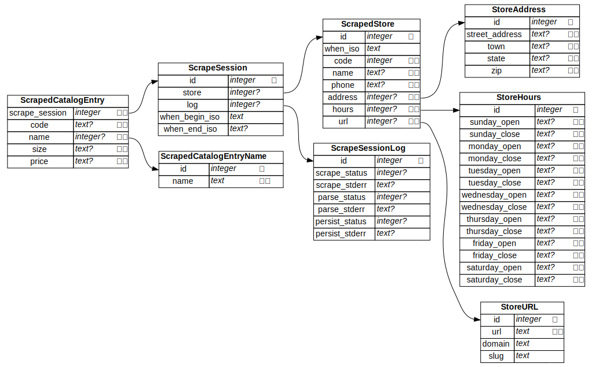

SQLiteViz
=========
Visualize SQLite database schemas.

This respository is a python package that takes a SQLite database file or
schema and produces a graph in `.dot` format, which can then be fed into
GraphViz (`dot`) to obtain a diagram of the database schema.

For example, [Makefile][1] transforms [schema.sql][2] into [schema.svg][3]:

```console
$ python ./ example/schema.sql | dot -Tsvg >example/schema.svg
```



- 🔑 means that a column is part of the primary key.
- ❄️ means that a column is part of a unique index. If a column belongs to more
  than one unique index, then the indices will be indicated by integer
  superscripts above the snowflake, e.g. ❄️¹ ² ⁴ of the column belongs to the
  first, second, and fourth unique index defined on the table.
- Edges between tables are foreign key constraints.

[1]: example/Makefile
[2]: example/schema.sql
[3]: example/schema.svg
